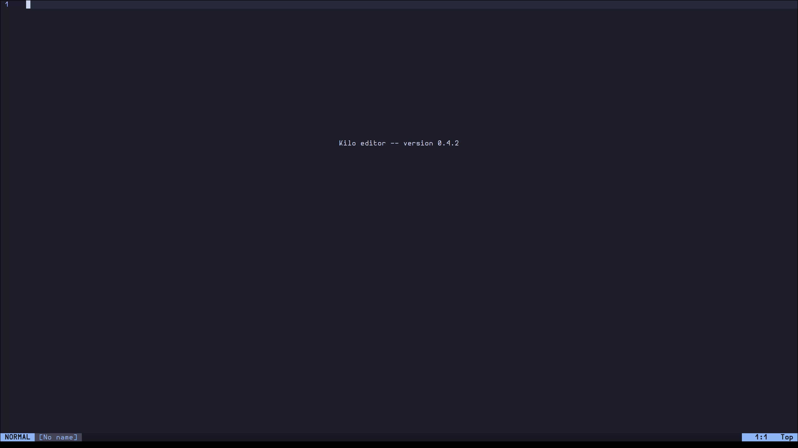
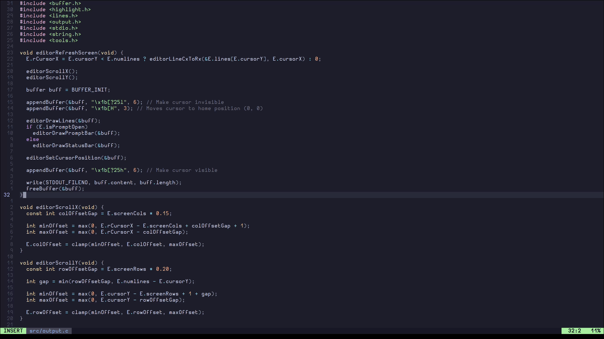

# Kilo Text Editor

This is my implementation of the Kilo Text Editor, made as final project for the [CS50x 2023](https://cs50.harvard.edu/x/2023/).

## Summary
* [Description](#description)
* [Usage](#usage)
* [Screenshots](#screenshots)
* [Movements](#movements)

## Description

##### These are the improvements I made over the [Build Your Own Text Editor](https://viewsourcecode.org/snaptoken/kilo/) tutorial:
* A new colorscheme, based on the [Catpuccin](https://github.com/catppuccin) mocha pallete (AKA best colorscheme ever)
* Improved syntax highlighting
* Improved keyword search engine
* Improved cursor vertical movement
* Improved scrolling
* Improved overall code readability
* Improved status bar design
* Relative line numbers
* Basic vim motions (Normal and Insert modes)
* Division of the project into multiple files

##### Possible future improvements (which I will probably never implement):
* Config file
* Undo/Redo feature
* Copy/Paste feature
* Support for multiple buffers
* Responsive design
* Mouse support (yes, I know it is useless)
* Improve vim setup
    * Add more vim motions
    * Visual and Visual Line modes
    * Support macros
* Add syntax highlighting for languages other than C

## Screenshots




## Usage
Clone the repo and enter the project folder
```console
git clone https://gitlab.com/ilovebooks/cs50x/kilo-text-editor.git
cd kilo-text-editor
```

Compile the project
```console
make
```

Run the Kilo Text Editor
```console
bin/kilo [filename]
```

If you want use this text editor as you may one (which I doubt you will),
put the bin file in your PATH.

## Movements

#### Basic commands

| Command / key         | Description                 
|:---------------------:|:----------------------:
| `Ctrl-Q`              | Quit
| `Ctrl-F`              | Find words
| `Ctrl-S`              | Save file
| ⬅ / ⬇ / ⬆ / ⮕         | Move cursor
| Home key              | Move to the start of line
| End key               | Move to the end of line
| Page up               | Scroll up by one screen
| Page down             | Scroll down by one screen

#### Vim motions
| Command               | Description                                                          
|:---------------------:|:----------------------:
| `Esc` / `Ctrl-C`      | Exit insert mode
| `i`                   | Insert before the cursor
| `I`                   | Insert at the beggining of the line
| `a`                   | Insert (append) after the cursor
| `A`                   | Insert (append) at the end of the line
| `o`                   | Append (open) a new line below the current line
| `O`                   | Append (open) a new line above the current line
| `x`                   | Delete character
| `s`                   | Delete character and substitute text
| `C` / `c$`            | Change (replace) to the end of the line
| `cc` / `S`            | Change (replace) entire line
| `D` / `d$`            | Delete (cut) to the end of the line
| `dd`                  | Delete (cut) a line
| `h` / `Backspace`     | Move cursor left
| `j` / `Return`        | Move cursor down
| `k`                   | Move cursor up
| `l` / `Space`         | Move cursor right
| `w`                   | Jump **forwards** to the **start** of a word
| `W`                   | Jump **forwards** to the **start** of a word (words can contain punctuation)
| `e`                   | Jump **forwards** to the **end** of a word
| `E`                   | Jump **forwards** to the **end** of a word (words can contain punctuation)
| `ge`                  | Jump **backwards** to the **end** of a word
| `gE`                  | Jump **backwards** to the **end** of a word (words can contain punctuation)
| `b`                   | Jump **backwards** to the **start** of a word
| `B`                   | Jump **backwards** to the **start** of a word (words can contain punctuation)
| `0`                   | Move to the start of line
| `$`                   | Move to the end of line
| `{`                   | Jump to previous paragraph
| `}`                   | Jump to next paragraph
| `gg`                  | Go to the first line of the document
| `G`                   | Go to the last line of the document
| `J`                   | Join line below to the current one with one space in between  
| `gJ`                  | Join line below to the current one without space in between  
| `zz`                  | Center cursor on screen
| `zt`                  | Position cursor on top of the screen
| `zb`                  | Position cursor on bottom of the screen
| `[num]gg` / `[num]G`  | Go to line "num" (num is a abitrary number)
| `[num]k`              | Move "num" lines up (num is a abitrary number)
| `[num]j`              | Move "num" lines down (num is a abitrary number)

